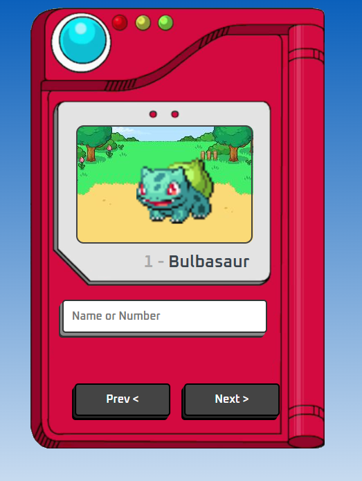

# Pokédex API

  
  
  
  

## Tópicos 

[Sobre a Pokédex API](#sobre-a-pokédex-api)

[Tecnologias](#tecnologias)

[Licença](#licença)

 
 

## Sobre a Pokédex API

A **Pokédex API** é uma aplicação desenvolvida para fornecer informações sobre os Pokémon. Utilizando uma interface intuitiva e responsiva, é ideal para desenvolvedores e entusiastas que desejam integrar dados de Pokémon em seus projetos ou aprender mais sobre o mundo dos Pokémon.

 

  

## Tecnologias

Tecnologias e ferramentas utilizadas no desenvolvimento do projeto:

- [HTML](https://devdocs.io/html/)
- [CSS](https://devdocs.io/css/)
- [Javascript](https://devdocs.io/javascript/)

 

## Licença

 

Esse projeto está sob a licença MIT. Veja o arquivo [LICENSE](/LICENSE) para mais detalhes.

---

Feito com ❤️ por [Seu Nome](https://github.com/seu-usuario)

 

